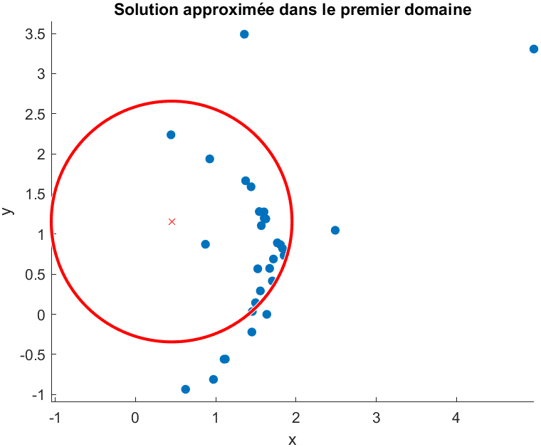
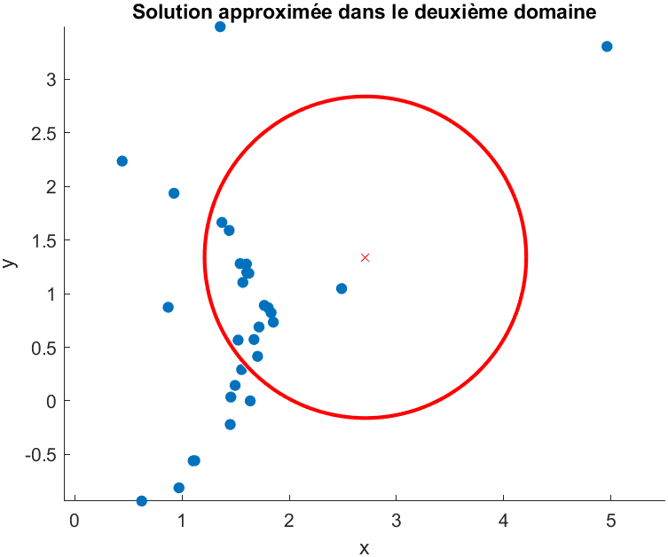
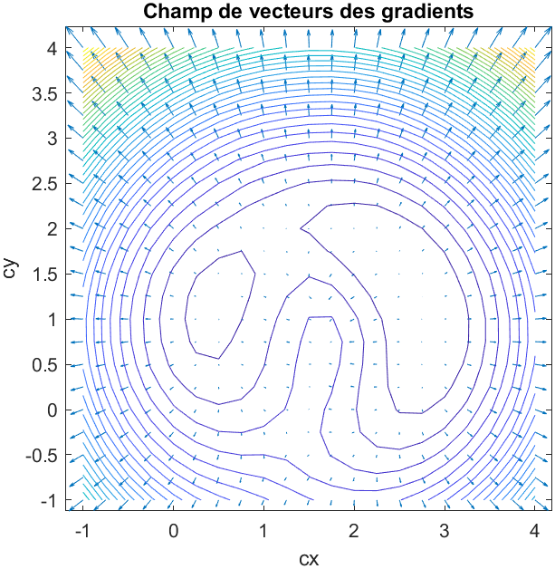

1. On a : $\pazocal{C}_{TLS}(c_{x},c_{y})=\displaystyle \sum _{i=1} ^{n} (D_{i}-R)^{2}$. On obtient les tracés suivants, avec un pas arbitraire de $0,05$ :

   | Sur $[-1,1] \times [-1,2]$          | Sur $[-1,4] \times [-1,4]$          |
   |:-----------------------------------:|:-----------------------------------:|
   | {width=300px} | {width=300px} |
   | {width=300px}    | {width=300px}    |
   : Représentations de $\pazocal{C}_{TLS}(c_{x},c_{y})$
   
   Sur la première figure, on a qu'un minimum, tandis que sur la seconde on en observe 2, qu'il faut départager. Il est préférable d'avoir une grande fenêtre, permettant de visualiser tous les minimums potentiels, plutôt qu'une petite fenêtre éliminant des solutions potentielles.

\newpage

2. Pour déterminer $c_{x}$ et $c_{y}$ à $10^{-4}$ près, on estime $N=\frac{(longueur~intervalle~x) \times (longueur~intervalle~y)}{pas^{2}}$ fois la fonction de coût $\pazocal{C}_{TLS}$, dans la mesure on l'on passe dans deux boucles `for`, sur l'intervalle `départ:pas:arrivée`.

   On a donc, sur $[-1,1] \times [-1,2]$, $N_{1}=\frac{2 \times 3}{10^{-8}}=6 \times 10^{8}$ estimations de la fonction de coût, et $N_{2}=25 \times 10^{8}$ estimations pour l'intervalle $[-1,4] \times [-1,4]$.

   On obtient les cercles et les nuages de points suivants :

   | Sur $[-1,1] \times [-1,2]$       | Sur $[-1,4] \times [-1,4]$       |
   |:--------------------------------:|:--------------------------------:|
   | {width=300px} | {width=300px} |
   : Estimations de $c_{x}$ et $c_{y}$

   On observe que les points aberrants influencent grandement le centre obtenu. La méthode n'est donc pas adaptée pour pouvoir déterminer le centre.

   Pour pouvoir approximer le rayon $R$, il faut prendre en compte le nombre d'estimations du rayon par boucle `for`, qui est donc de $N_{R}=\frac{2,5-0,5}{10^{-4}}=2 \times 10^{-4}$.
   
   Le nombre d'estimations de $\pazocal{C}_{TLS}$, est dorénavant de $N'_{1}=N_{1} \times N_{R}=1,2 \times 10^{13}$ sur $[-1,1] \times [-1,2]$, et de $N'_{2}=N_{2} \times N_{R}=5 \times 10^{13}$ sur $[-1,4] \times [-1,4]$.

3. En calculant le gradient à la main :

   $$
   \begin{split}
   \nabla \pazocal{C}_{TLS} (c_{x}, c_{y}) & = \begin{pmatrix}
                                  \displaystyle \frac{\partial}{\partial x_{i}} \sum_{i=1}^{n} (D_{i} - R)^{2}\\
								  \displaystyle \frac{\partial}{\partial y_{i}} \sum_{i=1}^{n} (D_{i} - R)^{2}
								  \end{pmatrix} \\
						      & = \begin{pmatrix}
                                  \displaystyle \sum_{i=1}^{n} \frac{\partial}{\partial x_{i}}  (D_{i} - R)^{2}\\
								  \displaystyle \sum_{i=1}^{n} \frac{\partial}{\partial y_{i}} (D_{i} - R)^{2}
								  \end{pmatrix} \\
   \nabla \pazocal{C}_{TLS} (c_{x}, c_{y}) & = \begin{pmatrix}
                                  2 \displaystyle \sum_{i=1}^{n} (c_{x} - x_{i}) (1 - \frac{R}{D_{i}})\\
								  2 \displaystyle \sum_{i=1}^{n} (c_{y} - y_{i}) (1 - \frac{R}{D_{i}})
								  \end{pmatrix} \\
   \end{split}
   $$

4. Tests à faire

5. En représentant le champ de gradient avec la fonction `quiver`, avec les lignes de contours, on a :

   
   
   Le gradient est bien orthogonal aux lignes de niveaux.

6. ...

7. ...

8. ...

9. ...

10. ...
    
	1. Pour la nouvelle expression du gradient, on a :
	
	2. Tests à faire
	
	3. Représentation du gradient avec la fonction `quiver` et les lignes de contours
	
	4. Méthode des plus fortes pentes, algo Fltecher-Lemaréchal
	
	5. Même étude avec d'autres points de départs
