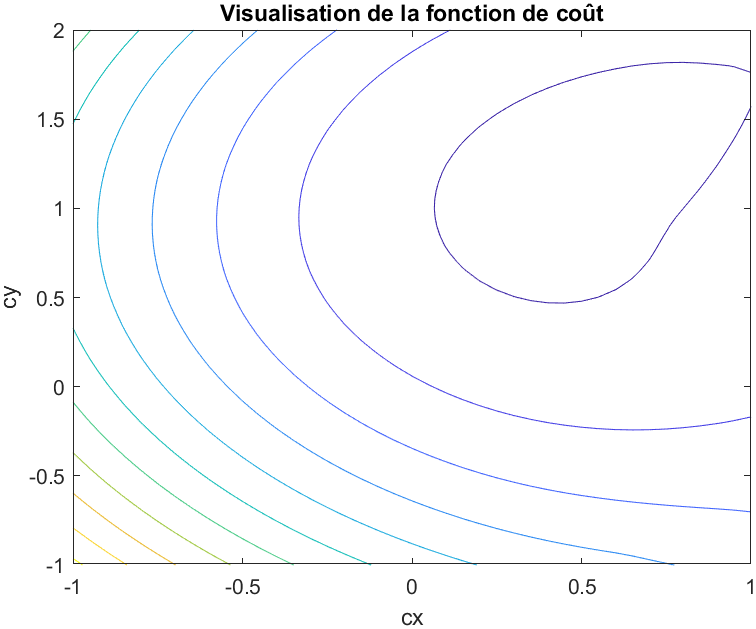
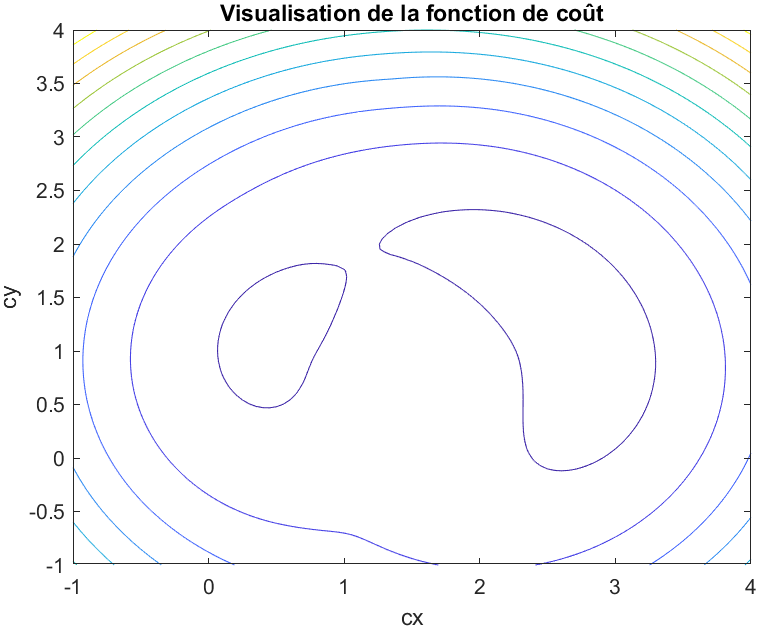
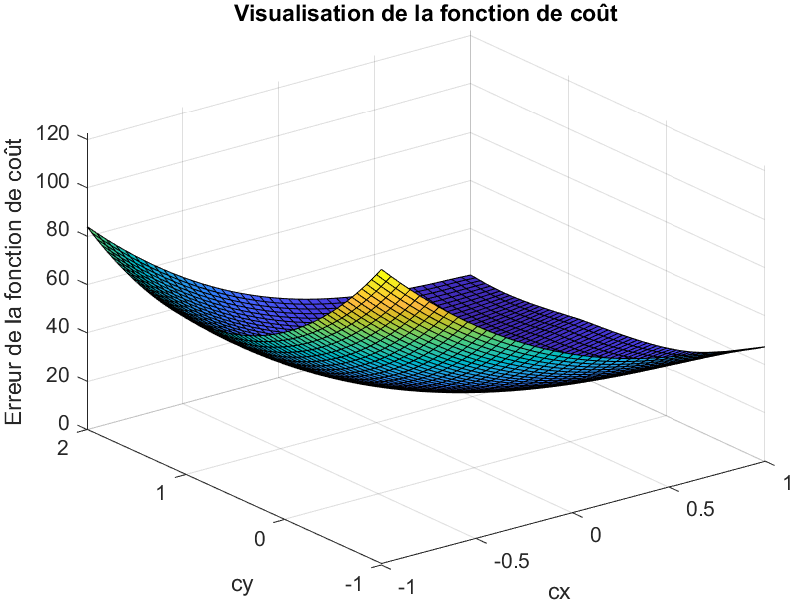
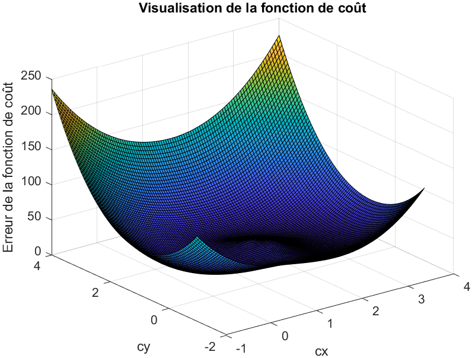

1. On a : $\pazocal{C}_{TLS}(c_{x},c_{y})=\displaystyle \sum _{i=1} ^{n} (D_{i}-R)^{2}$. On obtient les tracés suivants, avec un pas arbitraire de $0,05$ :

   | Sur $[-1,1] \times [-1,2]$          | Sur $[-1,4] \times [-1,4]$          |
   |:-----------------------------------:|:-----------------------------------:|
   | {width=300px} | {width=300px} |
   | {width=300px}    | {width=300px}    |
   
   Sur la première figure, on a qu'un minimum, tandis que sur la seconde on en observe 2, qu'il faut départager. Il est préférable d'avoir une grande fenêtre, permettant de visualiser tous les minimums potentiels, plutôt qu'une petite fenêtre éliminant des solutions potentielles.
   
2. Pas arbitraire de $10^{-4}$
