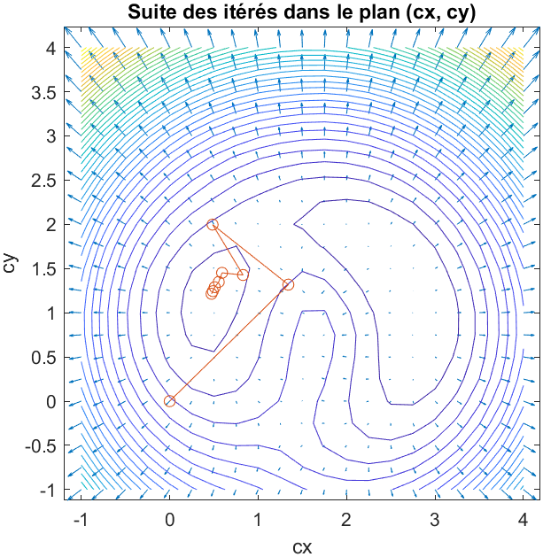
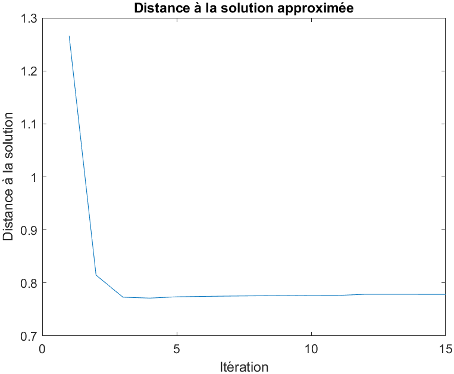
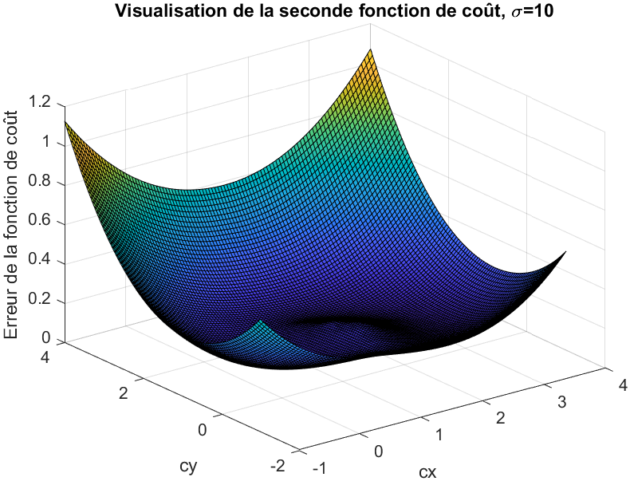
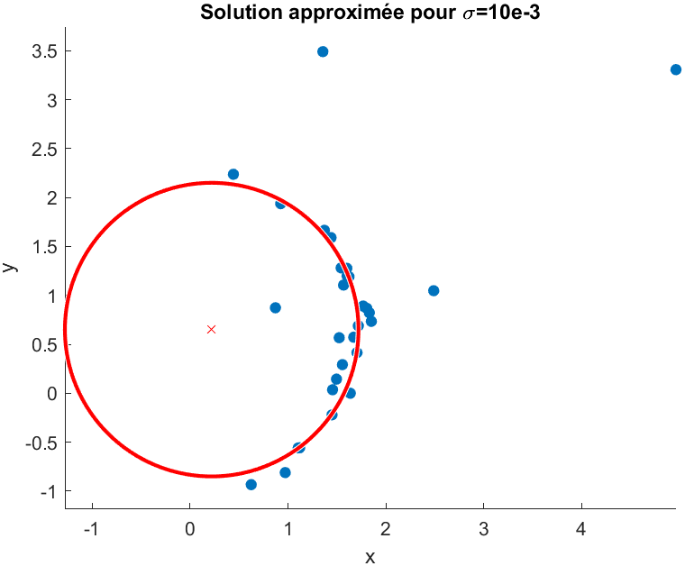
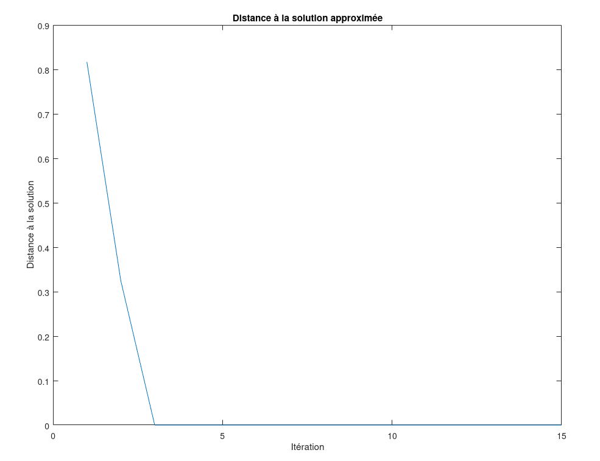

1. On a : $\pazocal{C}_{TLS}(c_{x},c_{y})=\displaystyle \sum _{i=1} ^{n} (D_{i}-R)^{2}$. On obtient les tracés suivants, avec un pas arbitraire de $0,05$ :

    | Sur $[-1;1] \times [-1;2]$             | Sur $[-1;4] \times [-1;4]$             |
    |:--------------------------------------:|:--------------------------------------:|
    | {width=250px} | {width=250px} |
    | {width=250px}    | {width=250px}    |

    Sur la première figure, on a qu'un minimum, tandis que sur la seconde on en observe deux, qu'il faut départager. Il est donc préférable d'avoir une plus grande échelle, permettant de visualiser tous les minimums potentiels, plutôt qu'une petite fenêtre éliminant d'office des solutions potentielles.

2. Pour déterminer $c_{x}$ et $c_{y}$ à $10^{-4}$ près, on estime $N=\frac{(longueur~intervalle~x) \times (longueur~intervalle~y)}{pas^{2}}$ fois la fonction de coût $\pazocal{C}_{TLS}$, dans la mesure on l'on passe dans deux boucles `for`, sur l'intervalle `départ:pas:arrivée`.

    On a donc, sur $[-1;1] \times [-1;2]$, $N_{1}=\frac{2 \times 3}{10^{-8}}=6 \times 10^{8}$ estimations de la fonction de coût, et $N_{2}=25 \times 10^{8}$ estimations pour l'intervalle $[-1;4] \times [-1;4]$.

    On obtient les cercles et les nuages de points suivants :

    | Sur $[-1;1] \times [-1;2]$          | Sur $[-1;4] \times [-1;4]$          |
    |:-----------------------------------:|:-----------------------------------:|
    | {width=250px} | {width=250px} |

    On observe que les points aberrants influencent grandement le centre obtenu. La méthode n'est donc pas adaptée pour pouvoir déterminer le centre.

    Pour pouvoir approximer le rayon $R$, il faut prendre en compte le nombre d'estimations du rayon par boucle `for`, qui est donc de $N_{R}=\frac{2,5-0,5}{10^{-4}}=2 \times 10^{-4}$.

    Le nombre d'estimations de $\pazocal{C}_{TLS}$ est dorénavant de $N'_{1}=N_{1} \times N_{R}=1,2 \times 10^{13}$ sur $[-1;1] \times [-1;2]$, et de $N'_{2}=N_{2} \times N_{R}=5 \times 10^{13}$ sur $[-1;4] \times [-1;4]$.

3. En calculant le gradient à la main :

    $$
\begin{split}
\nabla \pazocal{C}_{TLS} (c_{x}, c_{y}) & = \begin{pmatrix}
                                            \displaystyle \frac{\partial}{\partial x} \sum_{i=1}^{n} (D_{i} - R)^{2}\\
                                            \displaystyle \frac{\partial}{\partial y} \sum_{i=1}^{n} (D_{i} - R)^{2}
                                            \end{pmatrix} \\
                                        & = \begin{pmatrix}
                                            \displaystyle \sum_{i=1}^{n} \frac{\partial}{\partial x_{i}}  (D_{i} - R)^{2}\\
                                            \displaystyle \sum_{i=1}^{n} \frac{\partial}{\partial y_{i}} (D_{i} - R)^{2}
                                            \end{pmatrix} \\
\nabla \pazocal{C}_{TLS} (c_{x}, c_{y}) & = \begin{pmatrix}
                                            2 \displaystyle \sum_{i=1}^{n} (c_{x} - x_{i}) \left(1 - \frac{R}{D_{i}}\right)\\
                                            2 \displaystyle \sum_{i=1}^{n} (c_{y} - y_{i}) \left(1 - \frac{R}{D_{i}}\right)
                                            \end{pmatrix} \\
\end{split}
    $$

4. On choisit arbitrairement, pour tester le gradient, les points $(0;0)$, $(1;1)$, $(2,5;-0,5)$, $(3,5;2)$, $(0;3)$. On calcule le taux d'accroissement avec Matlab dans la fonction `gradient_diff_finie_1(point, delta)`, et on obtient les résultats suivants :

    | $x$ | $y$  | $\frac{\partial}{\partial x} \pazocal{C}_{TLS}$ | $t_{x}$ | $\frac{\partial}{\partial y} \pazocal{C}_{TLS}$ | $t_{y}$ | $\eta_{x}$ | $\eta_{y}$ |
    |:---:|:----:|:--------:|:--------:|:--------:|:--------:|:------:|:------:|
    | 0   | 0    | -21.4640 | -21.4617 | -21.0858 | -21.0846 | 0.0001 | 0.0001 |
    | 1   | 1    | 14.2961  | 14.2968  | -6.0875  | -6.0876  | 0      | 0      |
    | 2.5 | -0.5 | 3.2742   | 3.2758   | -20.7998 | -20.7982 | 0.0005 | 0.0001 |
    | 3.5 | 2    | 46.7235  | 46.7259  | 30.1031  | 30.1048  | 0.0001 | 0.0001 |
    | 0   | 3    | -42.8043 | -42.8024 | 61.9556  | 61.9579  | 0      | 0      |

    En notant $t_{x} = \frac{\pazocal{C}_{TLS} (x + \Delta_{x},y) - \pazocal{C}_{TLS} (x,y)}{\Delta_{x}}$ et $t_{y} = \frac{\pazocal{C}_{TLS} (x,y + \Delta_{y}) - \pazocal{C}_{TLS} (x,y)}{\Delta_{y}}$.  
    On note les erreurs relatives $\eta_{x}=\frac{\lvert \frac{\partial}{\partial x}\pazocal{C}_{TLS} - t_{x} \rvert}{\lvert \frac{\partial}{\partial x}\pazocal{C}_{TLS} \rvert}$ et $\eta_{y}=\frac{\lvert \frac{\partial}{\partial y}\pazocal{C}_{TLS} - t_{y} \rvert}{\lvert \frac{\partial}{\partial y}\pazocal{C}_{TLS} \rvert}$.
    
    On a choisit $(\Delta_{x}; \Delta_{y}) = (10^{-4}; 10^{-4})$, ce qui est suffisament précis, puisqu'on voit que l'erreur relative est sytématiquement négligeable.

5. En représentant le champ de gradient avec la fonction `quiver`, avec les lignes de contours, on a :

    \begin{center} 
    \includegraphics[width=220px]{Q5/champ_gradients.png}
    \end{center}

    Le gradient est bien orthogonal aux lignes de niveaux.

6. Par la méthode des plus fortes pentes, avec l'algorithme de Fletcher et Lemaréchal, on obtient la solution suivante :

    | Itérés depuis $(0;0)$                           | Distance à la solution                         |
    |:-----------------------------------------------:|:----------------------------------------------:|
    | {width=250px} | {width=250px} |

7. Selon le point de départ, on peut tomber dans le mauvais minimum, et donc avoir une solution erronée, comme l'illustre la figure suivante :

    | Itérés depuis $(3;-1)$                           | Distance à la solution                          |
    |:------------------------------------------------:|:-----------------------------------------------:|
    | {width=250px} | {width=250px} |

    Ainsi, il faut pour utiliser cet algorithme de manière pertinente avoir au préalable une idée de la solution voulue.

8. Avec la méthode de quasi-Newton, on obtient la convergence suivante :

    | Approximation depuis $(0;3)$        | Distance à la solution                    |
    |:------------------------------------:|:-----------------------------------------:|
    | {width=250px} | {width=250px} |

    Nous convergons vers le mauvais minimum, on observe toutefois une convergence plus rapide qu'avec l'algorithme de Fletcher et Lemaréchal. La distance à la solution est cependant très importante par rapport au susdit algorithme.

9. On considère la nouvelle fonction de coût $\pazocal{C'}_{TLS}(c_{x},c_{y},\sigma)=\displaystyle \frac{1}{2} \sum _{i=1} ^{n} \log\left(1 + \frac{(D_{i}-R)^{2}}{\sigma^{2}}\right)$, on obtient les résultats suivants :

    | $\sigma = 10^{-3}$                                          | $\sigma = 0.1$                                            | $\sigma = 10$                                            |
    |:-----------------------------------------------------------:|:---------------------------------------------------------:|:--------------------------------------------------------:|
    | {width=200px}         | {width=200px}         | {width=200px}         |
    | {width=200px} | {width=200px} | {width=200px} |
    | {width=200px}               | {width=200px}               | {width=200px}               |

    On peut voir que pour une valeur de $\sigma$ trop faible, la précision sera très grande, mais que les variations sont exacerbées :  cela peut avoir un impact sur la cohérence des résultats et faire apparaître des anomalies ponctuelles. De plus, le temps de calcul est grand et le programme perd donc en efficacité. A l'inverse, pour une valeur de $\sigma$ trop grande, on aura un lissage trop prononcé qui omettra les nuances, bien que l'efficacité soit grande. Il est donc nécessaire de privilégier une valeur de $\sigma$ qui soit un bon compromis entre ces facteurs :  une valeur située entre 0.1 et 10 telle que 1 semble être ce compromis recherché.

10.

    1. Pour la nouvelle expression du gradient, on a :

        $$
\begin{split}
\nabla \pazocal{C'}_{TLS}(c_{x}, c_{y}) & = \begin{pmatrix}
                                            \displaystyle \frac{\partial}{\partial x} \frac{1}{2} \sum_{i=1}^{n} \log\left(1 + \frac{(D_{i} - R)^{2}}{\sigma^{2}}\right) \\
                                            \displaystyle \frac{\partial}{\partial y} \frac{1}{2} \sum_{i=1}^{n} \log\left(1 + \frac{(D_{i} - R)^{2}}{\sigma^{2}}\right)
                                            \end{pmatrix} \\
                                        & = \begin{pmatrix}
                                            \displaystyle \frac{1}{2} \sum_{i=1}^{n} \frac{1}{1 + \frac{(D_{i} - R)^{2}}{\sigma^{2}}} \frac{\partial}{\partial x_{i}} \left( \frac{(D_{i} - R)^{2}}{\sigma^2} \right) \\
                                            \displaystyle \frac{1}{2} \sum_{i=1}^{n} \frac{1}{1 + \frac{(D_{i} - R)^{2}}{\sigma^{2}}} \frac{\partial}{\partial y_{i}} \left( \frac{(D_{i} - R)^{2}}{\sigma^2} \right)
                                            \end{pmatrix} \\
\nabla \pazocal{C'}_{TLS}(c_{x}, c_{y}) & = \begin{pmatrix}
                                            \displaystyle \sum_{i=1}^{n} \frac{D_{i} - R}{1 + \frac{(D_{i} - R)^{2}}{\sigma^{2}}} \frac{c_{x}-x_{i}}{D_{i} \sigma^2} \\
                                            \displaystyle \sum_{i=1}^{n} \frac{D_{i} - R}{1 + \frac{(D_{i} - R)^{2}}{\sigma^{2}}} \frac{c_{y}-y_{i}}{D_{i} \sigma^2}
                                            \end{pmatrix}
\end{split}
        $$

    2. Comme à la question 4, on choisit arbitrairement les points $(0;0)$, $(1;1)$, $(2,5;-0,5)$, $(3,5;2)$, $(0;3)$. On calcule le taux d'accroissement avec Matlab dans la fonction `gradient_diff_finie_2(point, delta)`, et on obtient les résultats suivants :

        | $x$ | $y$  | $\frac{\partial}{\partial x} \pazocal{C'}_{TLS}$ | $t'_{x}$ | $\frac{\partial}{\partial y} \pazocal{C'}_{TLS}$ | $t'_{y}$ | $\eta_{x}$ | $\eta_{y}$ |
        |:---:|:----:|:-------:|:-------:|:-------:|:-------:|:------:|:------:|
        | 0   | 0    | -4.7264 | -4.7256 | -4.8729 | -4.8726 | 0.0002 | 0.0001 |
        | 1   | 1    | 6.3604  | 6.3603  | -0.8662 | -0.8663 | 0      | 0.0001 |
        | 2.5 | -0.5 | 0.5615  | 0.5620  | -2.8751 | -2.8746 | 0.0009 | 0.0002 |
        | 3.5 | 2    | 9.9902  | 9.9904  | 5.4852  | 5.4854  | 0      | 0      |
        | 0   | 3    | -6.2627 | -6.2626 | 8.9474  | 8.9475  | 0      | 0      |

        En notant à nouveau $t'_{x} = \frac{\pazocal{C'}_{TLS} (x + \Delta_{x},y) - \pazocal{C'}_{TLS} (x,y)}{\Delta_{x}}$ et $t'_{y} = \frac{\pazocal{C'}_{TLS} (x,y + \Delta_{y}) - \pazocal{C'}_{TLS} (x,y)}{\Delta_{y}}$.

        L'erreur relative est, pour les points choisis, systématiquement négligeable.

    3. En représentant le champ de gradient avec la fonction `quiver`, avec les lignes de contours, on a :

        \begin{center} 
        \includegraphics[width=220px]{Q10/moins-Baptiste_(plus_nette).png}
        \end{center}

        Le gradient est bien orthogonal aux lignes de niveaux. On a prit pour ce gradient une valeur de $\sigma = 1$ en s'appuyant sur les résultats de la question 9 : pour rappel, un $\sigma$ de 1 garantit d'avoir un bon compromis entre l'efficacité du programme et sa précision.

    4. Par la méthode des plus fortes pentes, avec l'algorithme de Fletcher et Lemaréchal, on obtient la solution suivante :

        | Itérés depuis $(3;-1)$                  | Distance à la solution                    |
        |:---------------------------------------:|:-----------------------------------------:|
        | {width=250px} | {width=250px} |

    5. Comme précédemment, selon le point de départ, on peut tomber dans le mauvais minimum et aboutir à une solution erronée :

        **!refaire avec $\sigma = 1$!**

        | Itérés depuis $(3;-1)$                  | Distance à la solution                              |
        |:---------------------------------------:|:---------------------------------------------------:|
        | {width=250px} | {width=250px} |

